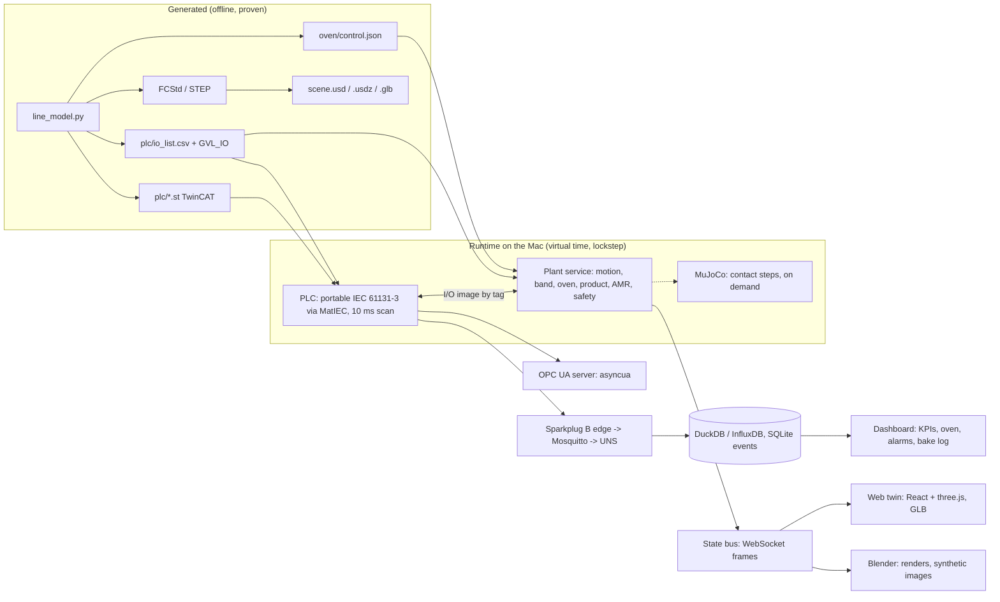

# STF-2 digital twin - overview

This folder describes how the STF-2 cookie line (`stf-cad/line2`) becomes a **running digital twin**:
- the full line in 3D;
- driven by the **same PLC program** the machine will run;
- a plant model that answers like the real hardware;
- the Industry 4.0 interfaces a factory would connect to (OPC UA, MQTT Sparkplug B / Unified Namespace).

All of it runs on one **MacBook with an Apple M4 and 24 GB of unified memory, with no hardware**.

| Document | What it answers |
|---|---|
| [TECH_STACK.md](TECH_STACK.md) | Every tool and library, why it was chosen, what replaces NVIDIA Omniverse on a Mac, the memory budget |
| [DATA_CONTRACT.md](DATA_CONTRACT.md) | Every file and signal the twin consumes or produces: paths, schemas, units, frames, names |
| [SIM_MODELS.md](SIM_MODELS.md) | The plant models (motion, process, oven thermal, product flow, safety), the PLC in the loop, the fault scenarios |
| [ROADMAP.md](ROADMAP.md) | Ten phases DT-1 … DT-10, each with what is built and the proof that gates it. **DT-1 (scene export) is built.** |
| [MAC_SETUP.md](MAC_SETUP.md) | Step-by-step install and run on the M4 Mac |

## The rule that does not change

The repository already works one way: **one parametric model is the source of truth, everything else is
generated from it, and nothing is exported unless its proofs pass.** The twin follows the same rule.
- The twin is never modelled by hand.
- The 3D scene, the kinematics, the signal list, the PLC program and the oven model are all generated from `line_model.py` and its companions.
- A twin that disagrees with the model is a failing proof, not a cosmetic issue.

```
line_model.L  (parameters, [assumed] / [typ] tagged)
   |-- line_model.build()      729 parametric parts  -> line_cad_precise.py -> 5,996 B-rep solids (FCStd, STEP)
   |-- oven.py / oven_ctrl.py  bake physics, zone model, PI + learning feed-forward, heater break
   |-- plc_io.py               181 signals, terminals, cabinet, wiring, TwinCAT ST program (plc/*.st)
   |-- safety.py               SF1-SF6, ISO 13855/13857 audit, PL estimate
   |-- line_sim.py             discrete-event line: stock, AMR, losses
   |-- motion.py               40 s timeline of 527 moving parts, swept for collisions
   '-- verify_plan.py          96 assumed values, +-20 % sensitivity
                 |
                 v   (this folder: what is added)
   DT-1 scene export (OpenUSD + glTF)          DT-6 contact physics (MuJoCo)
   DT-2 kinematic playback (web, Blender)      DT-7 renders + vision AI (Blender, PyTorch/MPS)
   DT-3 live plant service (real-time step)    DT-8 operations: dashboard, KPIs, fault injection
   DT-4 PLC in the loop (SIL, MatIEC)          DT-9 optional: Omniverse / Isaac Sim in the cloud
   DT-5 OPC UA + Sparkplug B / UNS             DT-10 hardware in the loop when the Beckhoff arrives
```

## What exists today, and what the twin adds

| Exists (proven, in `stf-cad/line2`) | The twin adds |
|---|---|
| Parametric model, 10 modules (M1 loop … M10 safety), 729 parts | A scene graph (OpenUSD) with every part, its tag, module and material |
| Precise CAD: 5,996 solids, STEP 65 MB, B-rep interference = 0 | Tessellated, instanced meshes for real-time viewing (USD/USDZ, GLB) |
| `motion/timeline.json`: 401 frames × 0.1 s, 527 tracks, FreeCAD player, PLAYER == MODEL | A **live** plant that is stepped in real time from the PLC outputs, instead of a recorded 40 s |
| TwinCAT 3 ST program (MAIN + 15 FBs + GVL_IO), 181 signals | A Mac-runnable PLC: the ST ported to portable IEC 61131-3, compiled by MatIEC, run against the plant |
| Oven physics + control proofs S1-S6 (bake ±2 K, heater break, model mismatch) | The same oven model as a live process in the twin, with fault injection from the dashboard |
| Line simulation (stock, AMR, losses), safety functions, BOM, wiring | OPC UA server, Sparkplug B edge node, UNS, time series, per-cookie bake log, KPIs |
| — | Contact physics for the handling steps, photoreal renders, a vision model trained on renders |

The first cell (the fischertechnik factory on `main`) already went this way: a three.js twin, a MatIEC → WebAssembly PLC
(Upgrade 13), OPC UA on the Machinery companion spec, Sparkplug B + UNS on Mosquitto (Upgrade 14), and a vision CNN trained on renders (Upgrade 15).
STF-2 **reuses those patterns and their code** (`stf-cad/hbw/sil`, `opcua`, `uns`, `vision` on `main`).
It does not start a second stack.

## Architecture (runtime)



## Omniverse on this Mac: the short answer

NVIDIA Omniverse and Isaac Sim do **not** run on macOS. They need Linux or Windows and an NVIDIA RTX GPU
(Isaac Sim 5 lists an RTX 4080 with 16 GB VRAM as its minimum). The plan therefore keeps
**OpenUSD** (Omniverse's own scene format) as the canonical scene, and uses Mac-native tools around it:
- MuJoCo for physics;
- Blender (Metal) for rendering;
- three.js for the live view;
- Python for the plant;
- MatIEC for the PLC.

The same USD stage can later be opened in Omniverse or Isaac Sim on a rented cloud RTX machine and streamed to the
Mac's browser (DT-9), with no remodelling. Details and alternatives are in [TECH_STACK.md](TECH_STACK.md).

## Definition of done

The twin is "done" when the gates below pass in CI on the Mac, with the PLC deciding everything:
1. One hour of nominal production runs in virtual time.
2. Every fault scenario in [SIM_MODELS.md](SIM_MODELS.md#fault-catalogue) gives the response the proofs predict.
3. The OPC UA and Sparkplug conformance checks pass.
4. The 3D view shows the state at every step (PLAYER == PLANT).

Full list: [ROADMAP.md](ROADMAP.md#acceptance).
